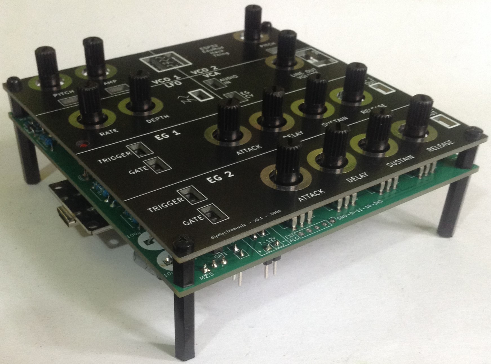
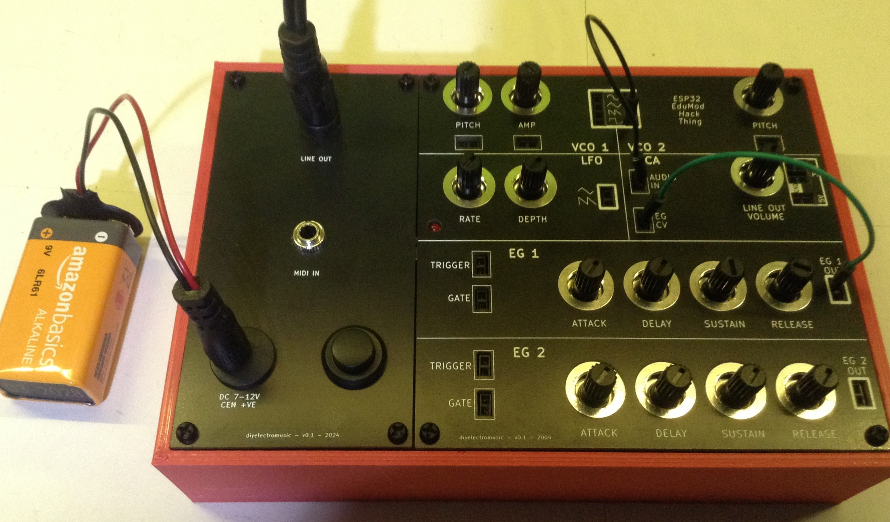

# ESP32EduModHackThing

ESP32 based, hacked together modular-synth like thing to help learn the basics of analog synthesis and hook up to breadboards for experimenting with circuits.

* Blog series: https://diyelectromusic.wordpress.com/2024/05/07/educational-diy-synth-thing/

Work in progress.  Watch this space...

## Hardware

**Be sure to read the Errata and limitations in the design notes**

Contents of the [Hardware](/Hardware) directory:
* Main PCB - 100x100mm main PCB.
* 24pin DIP Adaptor - small adaptor PCB as a workaround to the errata about the 24-pin DIP socket.
* Front Panel - 100x100mm PCB files that can be used as a front panel.

Note: The above does not include any connections for MIDI, audio, or power.  See the build notes for details.

Additional hardware (optional):
* Connector Panel - 50x100mm PCB files that can be used as an additional accessories/connectors panel.
* 3D Printer STL file - 150x100x35mm approx enclosure for a front panel and connector panel.
* 3D Printer STL file for a low quality tool to help screw in the hex-spacers.

Main PCB:
* PCB Design Notes: https://diyelectromusic.wordpress.com/2024/05/07/esp32-wroom-educational-modular-synth-thing-pcb-design/
* PCB Build and Test Notes: https://diyelectromusic.wordpress.com/2024/05/19/esp32-wroom-educational-modular-synth-thing-pcb-design-build-guide/

## Code Directories

* HardwareTestCode - contains a series of sketches that can be used to test specific elements of the board.
* Firmware - contains the current release of the core firmware to perform all the functionss as described in the blog series.

## License, Use, Feedback, Contributions

Released under a MIT license.  No fitness for any purpose suggested or implied.  Use at your own risk.  I am not an electronics person - I'm just messing around.

**Do not plug this into anything else and certainly not anything expensive or wanted.**

Contributions are not being accepted.  This is just a repository for the design, but suggestions and conversations about it welcome on my blog or via social media.

Kevin

_All code and designs Copyright (c) Kevin (diyelectromusic)_
